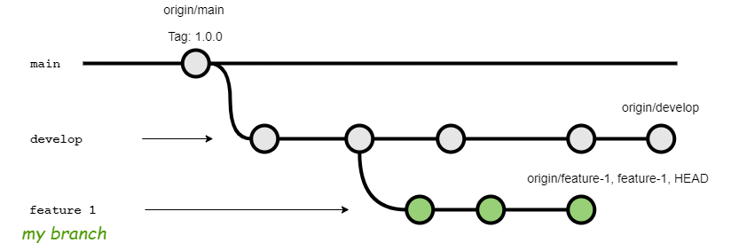

# git-mybranch

A Git subcommand for operating your draft branch



## Usages

Show commits on your working branch

```
git mybranch log
```

Create a fixup commit to your created commits in current branch

You can choose a commit interactively if `fzf` is installed
```
git mybranch fixup
```

Rebase your working branch onto the specified branch

```
git mybranch rebase --onto origin/develop
```

Edit (rebase) your branch interactively

```
git mybranch rebase -i
```

Show changes on your working branch

```
git mybranch diff
```

## Install

```
curl -L https://raw.githubusercontent.com/negokaz/git-mybranch/main/git-mybranch.sh \
    -o /usr/local/bin/git-mybranch \
&& chmod +x /usr/local/bin/git-mybranch
```

## LICENSE

Copyright (c) 2021 Kazuki Negoro

git-mybranch is released under the [MIT License](LICENSE)
